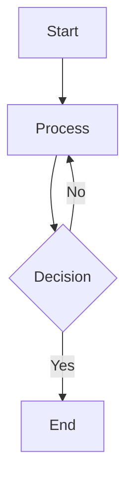
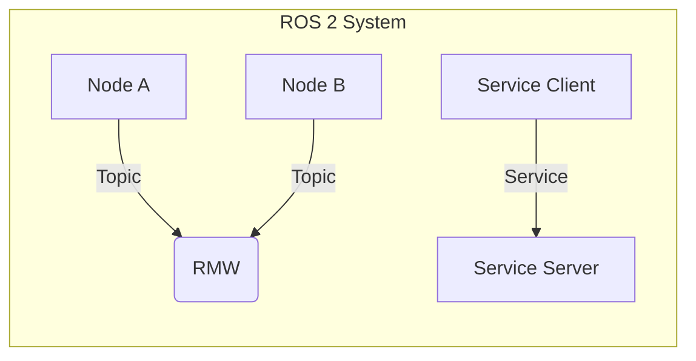
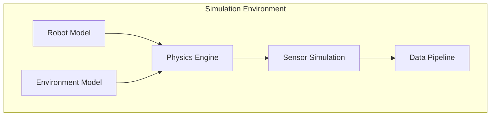
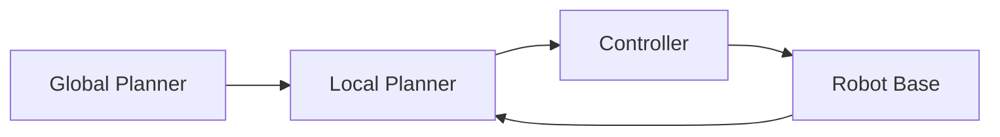

# Tools for Generating Architecture Diagrams

## Overview
This document outlines tools and techniques for generating architecture diagrams from text descriptions. These tools can be used to create visual representations of system architectures for the educational content.

## Text-Based Diagram Tools

### 1. ASCII Diagram Tools
- **Asciiflow**: Simple web-based tool for creating ASCII diagrams
- **Textik**: Online text-to-diagram tool with various templates
- **Monodraw**: Desktop application for creating ASCII diagrams (macOS only)

### 2. Markdown-Compatible Diagram Tools
- **Mermaid**: Diagramming and charting tool that uses markdown-inspired text definitions
  - Supported in Docusaurus via MDX
  - Can create flowcharts, sequence diagrams, class diagrams, etc.
  - Example syntax: 
    ```mermaid
    graph TD
        A[Robot] --> B[ROS Nodes]
        B --> C[Sensors]
        B --> D[Actuators]
    ```

### 3. PlantUML
- Text-based UML tool that can generate various types of diagrams
- Integrates with documentation tools
- Supports various diagram types: sequence, use case, class, activity, etc.

### 4. Graphviz
- Open source graph visualization software
- Uses DOT language to describe graphs
- Good for complex network diagrams

## Recommended Approach for This Project

### 1. Primary: Mermaid
For the Docusaurus-based educational content, Mermaid is recommended as it:
- Integrates well with Markdown/MDX
- Is supported natively in Docusaurus
- Allows for version control of diagram source
- Is easy to modify and maintain

### 2. Secondary: Text-Based Diagrams
For simple diagrams that don't require complex rendering, continue using the text-based templates created in the architecture diagram templates document.

## Using Mermaid in Docusaurus

To use Mermaid diagrams in Docusaurus pages, you can include them directly in Markdown:

```markdown

```

## Example Architecture Diagrams in Mermaid

### ROS 2 System Architecture


### Simulation Architecture


### Navigation Stack


## Best Practices

1. Keep diagrams simple and focused on the concept being taught
2. Use consistent naming conventions
3. Include labels that explain the purpose of each component
4. Use colors sparingly and consistently
5. Ensure diagrams are accessible (include alt text when possible)
6. Maintain diagrams alongside the code/content they represent
7. Use the templates from the architecture diagram templates document as a starting point